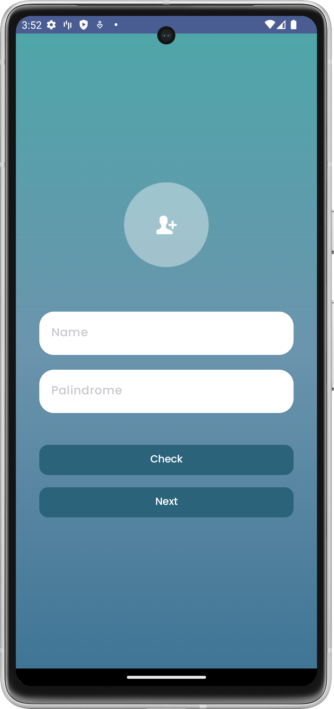
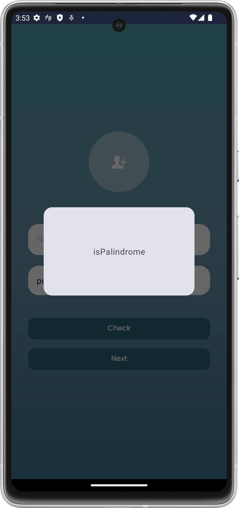
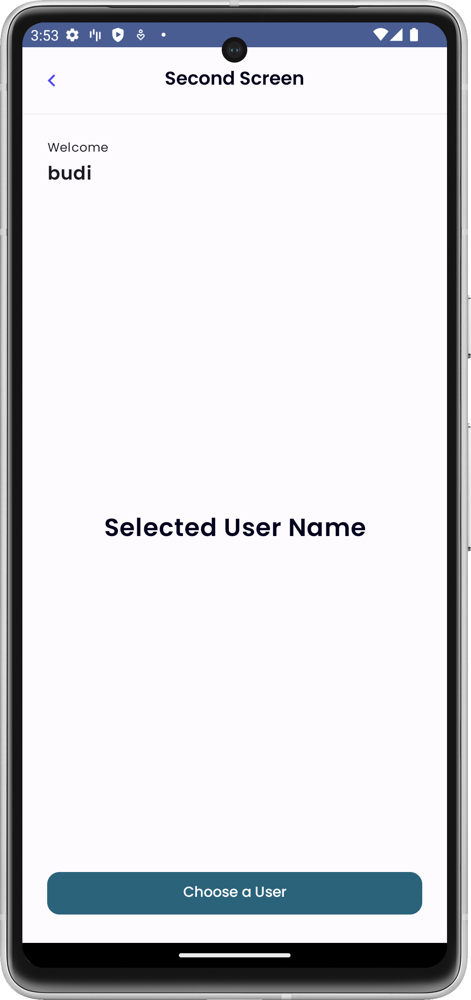

# **Suitmedia Test** 
This repository is a test for an internship entry at Suitmedia.  

## Built With 🛠
- [Kotlin](https://kotlinlang.org/) - First class and official programming language for Android development.
- [Jetpack Compose](https://developer.android.com/jetpack/compose) - Modern Android UI toolkit for building native interfaces with Kotlin.
- [Android Architecture Components](https://developer.android.com/topic/libraries/architecture) - Collection of libraries that help you design robust, testable, and maintainable apps.
    - [ViewModel](https://developer.android.com/topic/libraries/architecture/viewmodel) - Stores UI-related data that isn't destroyed on UI changes.
    - [Lifecycle](https://developer.android.com/jetpack/androidx/releases/lifecycle) - Manages Android lifecycle-aware components.
    - [Paging](https://developer.android.com/topic/libraries/architecture/paging) - Helps load and display large datasets efficiently.
- [Navigation Compose](https://developer.android.com/jetpack/compose/navigation) - Navigation library for Jetpack Compose.
- [Retrofit](https://square.github.io/retrofit/) - A type-safe HTTP client for Android and Java.
- [GSON](https://github.com/google/gson) - A modern JSON library for Kotlin and Java.
- [GSON Converter](https://github.com/square/retrofit/tree/master/retrofit-converters/gson) - A Converter which uses GSON for serialization to and from JSON.
- [OkHttp Logging Interceptor](https://github.com/square/okhttp/tree/master/okhttp-logging-interceptor) - Logs HTTP requests and responses for debugging.
- [Material3](https://developer.android.com/jetpack/androidx/releases/compose-material3) - The latest Material Design components for building modern UI experiences.
- [Coil](https://github.com/coil-kt/coil) - An image loading library for Android using Kotlin and Jetpack Compose.

 ## 📸 Screenshots
||||
|:----------------------------------------:|:-----------------------------------------:|:-----------------------------------------: |
|  |  |  |
|  |  |  | 
